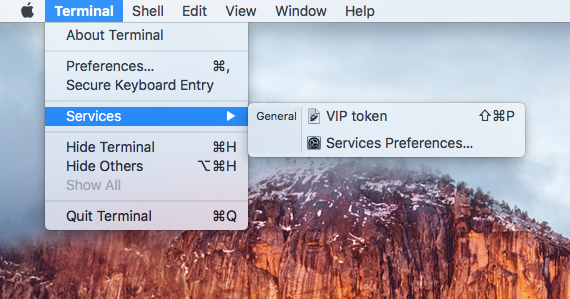

# totp-service
This is an OS X service for users of "Symantec VIP Access" to avoid having to copy and paste the "Security code" into applications that need the code. The service creates a keyboard shortcut that will print a code. The content of the clipboard is not affected.

The service assumed that you have ran the "Symantec VIP Access" application before on the computer. The service will read the shared secret used by VIP Access from the keychain. You do not need to register a new instance with Symantec, and the VIP Access app does not need to be running.

To install, copy the VIP token.workflow folder into ~/Library/Services/. Once that's done, the service should show up in the services menu. I had to reboot for the service to show up correctly. 

This is how the service should show up in the the terminal app:

Now, if you open a terminal or browser window, a TOTP will be printed when you press Shift+Command+P. The shortcut can be changed under "Services preferences" under the services menu item.

Some people has reported that they need to run a service from the menu once before the shortcut works.

The source code can be viewed and edited by opening the .workflow folder in the automator application.
